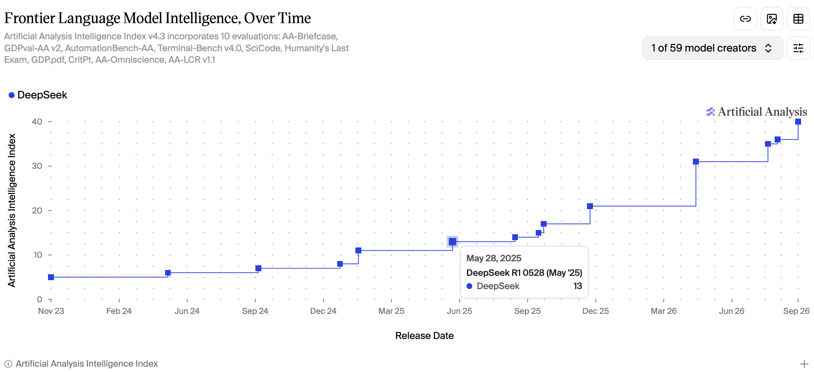
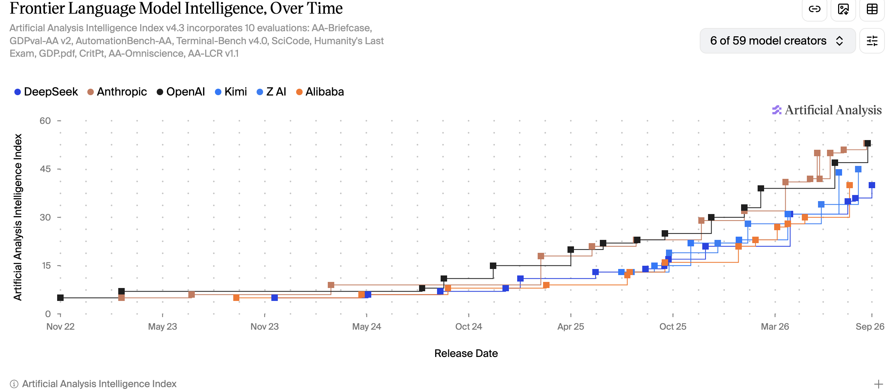

Title: Models are getting better AND releasing faster
Date: 2026-09-13 23:59
Tags: ai, inference, benchmark, llm

[TOC]

DeepSeek v4.1 Flash hid a whole release's worth of improvements in a minor version number.

GPT 5.4 (xhigh) on March 5th, 2026 had a benchmark score of 39. Six months later, DeepSeek matched that score, and now it's available for **10x cheaper**.

DeepSeek, in less than 16 months, tripled their "intelligence score".




|Name|Input tokens|Output tokens|Cache discount|"Intelligence Score"|
|--|--|--|--|--|
|OpenAI GPT 5.4 (xhigh)|$2.50|$15.00|90%|**39**|
|DeepSeek V4.1 Flash|$.30|$1.20|98%|**40**|

*costs in the usual "per million tokens"*

- <https://artificialanalysis.ai/models/gpt-5-4>
- <https://artificialanalysis.ai/models/deepseek-v4-1-flash>


*Caveat: benchmarks can be gamed ("benchmaxxing"), they are not representative of your exact task.*

# Directional Trend - up and to the right

The orange and black of Anthropic and OpenAI are always on top, frequently exchanging the lead.

The clustering of more releases in 2026 is competition at its finest: capabilities are improving and releases are happening more frequently.

Consistently, within 6 months, the leading open weight providers close the gap. The frontier labs have to keep pushing in order to stay ahead.



<https://artificialanalysis.ai/trends?model-creators=deepseek%2Canthropic%2Copenai%2Ckimi%2Czai%2Calibaba>

*For more of my charts/visualizations of the Artificial Analysis Intelligence benchmarks <https://feneky.com/benchmarks>*

# Architecture analysis by Sebastian Raschka

> Tbh they should have called it DeepSeek V5!


- <https://xcancel.com/rasbt/status/2098142625819672603#m>

"552B backbone + 196B Engram; 8B active prefill, 16B active decode - and it has vision"

Read Sebastian's full breakdown of the architecture, or peruse the DeepSeek release paper or VLLM recipe:

- <https://sebastianraschka.com/llm-architecture-gallery/#card-deepseek-v4-1-flash>
- <https://huggingface.co/deepseek-ai/DeepSeek-V4.1-Flash/blob/main/DeepSeek_V41_Tech_Report.pdf>
- <https://recipes.vllm.ai/deepseek-ai/DeepSeek-V4.1-Flash>

# Testing it myself

Amazing architecture is great to read about, what happens when you use it?

I used a baseline of neutral, standards-based tools: the harbor framework, terminal bench 2.1, and the terminus-2 harness (agent).

In previous testing I've found smaller models are successful on 34 of the 89 tasks, so it's become my "empirically easy subset".

*For more info on using Harbor and Terminal Bench, and why I like a realistic work (toil) agentic task:
<https://blog.john-pfeiffer.com/reproducing-a-coding-benchmark-with-harbor-and-terminal-bench-21/>*

## DeepSeek V4.1 Flash Terminal Bench 2.1 Subset Results

**33 of 34** pass @1, at a cost of $1.37 (950K uncached input, 5M cached input, 779K output tokens).

Peak throughput: ~7,500 tokens/sec and time to first token: ~260ms.

*KV cache hit rate: 85%+ (inflated by how agent loops on a terminal task accumulate context).*

## The Easy One Fail

The one failure was an ELF binary parser, and it was a close one.

"Write extract.js to parse an ELF binary and output {address: value} pairs as JSON, reading 4-byte little-endian words from loadable segments"

The model spent ~5,000 reasoning tokens per step deliberating about the correct load base address, and still picked wrong. It never tested an alternative.

The fix was changing one constant. `LOAD_BASE = 0`

<https://hub.harborframework.com/tasks/terminal-bench/extract-elf/latest>

## Easy vs Hard Tasks

What about some "hard" tasks? (When everyone gets 100% on the easy ones...)

"Hard" tasks, as identified in the original paper <https://arxiv.org/html/2601.11868v1#A8>, provide a way to differentiate between model capabilities.

V4.1 Flash solved dna-assembly and protein-assembly, V4 Flash 0731 failed on both.

- <https://hub.harborframework.com/tasks/terminal-bench/dna-assembly/> 
- <https://hub.harborframework.com/tasks/terminal-bench/protein-assembly/>

*Given that Terminal Bench 2.1 is near saturated by the frontier models <https://www.vals.ai/benchmarks/terminal-bench-2-1>, I will have to shift to a newer version of terminal bench , probably just a subset since the cost to run the full thing increases from hundreds to thousands of dollars*

## Not all Inference Providers are equal

> Quantization and other cost/efficiency optimizations for serving inference really do affect the quality of the outcomes

I won't share the name of the Provider, but they provided DeepSeek V4 Flash 0731 at a discount, and using their API with my usual harbor/terminal-bench-2.1, **only 22 of 34 passed** (consistent across 2 runs).

Using the OpenRouter UI I was able to suss out that the Provider serving DeepSeek V4 Flash 0731 likely uses precision **FP4**.

With Baseten, I re-ran V4 Flash 0731, **32 of 34 ("easy") tasks passed**, at a cost of $0.52. *So "0731" really is incredibly cheap and effective.* According to the OpenRouter UI, Baseten's V4 Flash 0731 is using FP8.

<https://huggingface.co/deepseek-ai/DeepSeek-V4-Flash-0731> (the open weights model card indicates 8-bit precision ;)

More info on quantization: <https://www.baseten.co/blog/33-faster-llm-inference-with-fp8-quantization/>

How a provider serves a model (e.g. quantization) is a bit of "caveat emptor", and there are just now early attempts at measuring this moving target too: <https://artificialanalysis.ai/#providers>


# Closing Thought

It is good that the competition of open weight models increases access to artificial intelligence for everyone!

(Innovations in model architecture, and improvements in serving inference, are bringing the future here faster).

```text
┌─────────────────────────────────────────────────────────────────────────────────────────────────────────┐
│                    USERS (Billions)                                                                     │
└─────────────────────────────────────────────────────────────────────────────────────────────────────────┘
     ┌───────────────────────────────────────────────────────────────────────┐
     │           APPLICATIONS / AGENTS (Millions)                            │
     └───────────────────────────────────────────────────────────────────────┘
          ┌──────────────────────────────────────────┐
          │   INFERENCE PROVIDERS (~100)             │
          └──────────────────────────────────────────┘
            ┌────────────────────────────────────┐
            │ FOUNDATION MODEL COMPANIES(~50)    │
            └────────────────────────────────────┘
                ┌───────────────────────────┐                   
                │  HARDWARE COMPANIES(~20)  │
                └───────────────────────────┘

```

*You can see why vertical integration and a monopoly on AI is so appealing...*


# Appendix

I have no affiliation with, but easily used Baseten as the inference provider.

1. Setup an account
2. Get an API key
3. Add a credit card (payment method)
4. Scroll down on <https://app.baseten.co/settings/billing> to get to "Monthly budget" and "Enforce budget" - this prevents any runaway spend issues.

> If enforced, Model API requests will automatically be rejected as soon as the budget is reached.

*Note Baseten operates on "pay after" whereas many other providers require you to pay up front for credits*

It appears most of their business model is actually focused on serving organizations training and customizing/fine-tuning an open weight model. Their value proposition is handling all the orchestration/management/storage/ops for inference. <https://docs.baseten.co/inference/overview>

