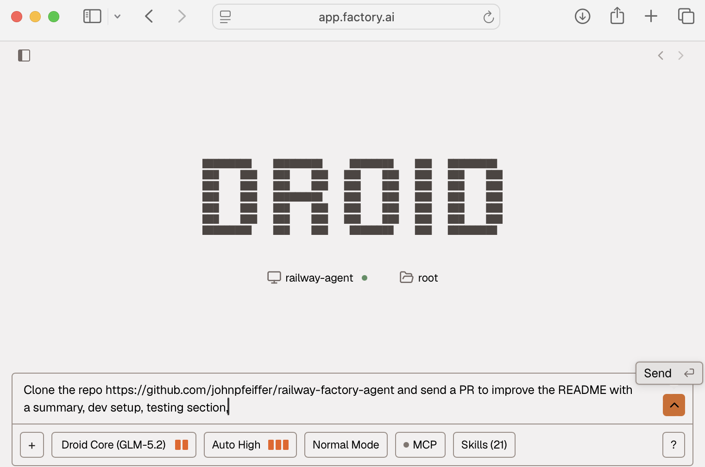

Title: A coding agent in the cloud with Factory and Railway
Date: 2026-06-22 09:10
Tags: ai, agent, factory, railway

[TOC]

# Untether your coding from your Laptop

My "coding with AI" progression is likely similar to your own:

- (2022) "legacy coding" =]
- (2023) ChatGPT assisted "copy-paste" coding  
- (2024) GitHub Copilot tab-completion coding
- (2025) Coding agents in the terminal: Claude Code and OpenAI Codex
- (2026) **YOU ARE HERE**

> We've all walked around holding our laptop with the lid half-closed, to give our coding agent just a few more minutes

When I found myself trying to type in a prompt at a stop-light while driving, I knew I had to upgrade to a better approach.

Here's a fast way to build a simple, always-on, coding agent in the cloud: 1 Dockerfile + 1 startup script + 2 Environment variables.

> With this one step, human attention becomes the bottleneck



## Prompt to Code

It is a simple chat web UI - in the center you can select a computer (i.e. `railway-agent`)

Select your model. I have found using the open weight (only uses .55x quota) **(Droid Core) GLM 5.2 at reasoning level "max" and "Auto High" autonomy** to be very effective.

Give it a prompt:

> Clone the repo https://github.com/johnpfeiffer/railway-factory-agent and tell me what it does

The Factory droid coding agent will use the `gh` command line tool and take care of the rest, including, if prompted to, sending a Pull Request.

Use the browser on your phone to login to https://app.factory.ai/ - continue the conversation and have it work for a few minutes or an hour.

Then use the GitHub mobile app to Review and Approve =)

*Get comfortable progressively: have the agent explain a repo, then write documentation and send a pull request, have it add unit test coverage, fix a tiny typo or content, etc*

# High Level Overview

> Hosting environment + Coding Agent + API Keys

A coding agent is just a software program that repeatedly calls an LLM, has a "harness" to use the command line and tools, and writes/edits (text) code files.

<https://blog.john-pfeiffer.com/ai-with-agents-aka-llms-with-tools/>

Consider this an ephemeral work environment. The only tools provided are those in the Docker container, or what the agent downloads and installs.

## Under the hood

The container running in Railway (aka Factory BYOM) connects out to Factory's relay (`relay.factory.ai`) when you run `droid daemon --remote-access`, so **no inbound ports are required**.

```diagram
╭──────────────────────────────────────────────╮     ╭──────────────────╮
│ Railway container (Debian, headless, no TTY) │     │ Factory          │
│                                              │     │                  │
│  FACTORY_API_KEY ──▶ authenticate to Factory │     │                  │
│  droid computer register factory-droid-agent │────▶│ relay.factory.ai │
│  droid daemon --remote-access ───────────────│────▶│ (outbound only)  │
│                                              │     │                  │
│  /root/.factory  ◀── persisted on a Volume   │     ╰──────────────────╯
╰──────────────────────────────────────────────╯


                        [GitHub]

```

You can use Railway's SSH or Console to have a (root) shell into the container and interact/observe, like: `ls -ahl /root/.factory`


## Security via a separate GitHub account

For the security best practice of "least privilege" and isolation I created a separate GitHub account for my coding agent(s).

The agent's github account is invited as a Collaborator to GitHub Repositories, and contributes via Pull Requests.

This creates clarity and audit trails of code authorship - including commit messages.

An example Pull Request: <https://github.com/johnpfeiffer/railway-factory-agent/pull/1>

> The human reviews, approves, and merges Pull Requests

### Agent Access with Personal Access Tokens

The most painful part of many projects can be getting permissions correct. =|

When logged into your Agent's GitHub account:

GitHub -> Settings -> Developer settings (all the way on the bottom left) -> Personal access tokens -> Tokens (classic)

Permissions:

- repo *(the token has full read/write to every repo the account can see)*
- admin:org -> read:org *(gh CLI expects it for org membership lookups)*

Save the key in a password manager - it may look like `ghp_...`

**Gotcha**: *do not use the newer tokens with fine grained access control because of a limitation for outside collaborators on a repo.*

<https://docs.github.com/en/authentication/keeping-your-account-and-data-secure/managing-your-personal-access-tokens#fine-grained-personal-access-tokens-limitations>

*Or, if you want to stick with fine grained tokens: create an Organization, add your agents to your organization, manage their access to repositories that way.*

# Factory Droid as the Coding Agent

Factory is a startup that built their own agent and "cloud factory", and I'm leveraging their off-the-shelf capabilities that handle:

- the coding agent (harness)
- subscription plan for a LLM
- a dashboard UI to organize the prompts and history
- a relay/tunnel to stay connected to a container containing the coding agent
- *manage multiple agents across multiple computers, including the option for a long running "mission" - out of scope for this post*

After creating the account, the next step is to create an API key.

*optionally you can install the droid coding agent locally onto your computer and experiment with it*

Use <https://app.factory.ai/settings/api-keys> or in the Factory UI, bottom left corner, click on YOUR USERNAME -> Settings -> API Keys -> CREATE KEY

```
Key Name: droid-registration
Expiration: SELECT-A-DATE
```

*Via the CLI <https://docs.factory.ai/api-reference/service-accounts/create-a-service-account-api-key>*

Save the key in a password manager - it looks like `fk-...`

Rather than pay for Factory's managed compute/machine, and for more visibility and control, you can bring your own hosting: <https://docs.factory.ai/cli/features/droid-computers-byom>

*I received a year's worth of credits for Railway and Factory as part of my subscription to the podcast and substack Lenny's Product Pass, my documented approach would cost $25 a month*

# Hosting with Railway

A newish hosting company is **[Railway](https://docs.railway.com/builds/dockerfiles)** who offer integration from GitHub commit to live deployment in production.

The perfect place to provide an isolated environment with CPU and RAM, local disk, and network.

Use the simplest infrastructure-as-code: a tiny GitHub repo with a Dockerfile, <https://github.com/johnpfeiffer/railway-factory-agent>

<details>
Dockerfile: Debian + GitHub CLI + Droid

```bash
FROM debian:trixie-slim

RUN apt-get update && apt-get install -y \
    bash curl wget git ca-certificates jq procps \
    python3 python3-pip python3-venv \
    nodejs npm \
    build-essential \
    ripgrep fd-find tree unzip zip sqlite3 \
  && rm -rf /var/lib/apt/lists/*
  
# GitHub CLI https://github.com/cli/cli/blob/trunk/docs/install_linux.md#debian
RUN mkdir -p -m 755 /etc/apt/keyrings \
  && wget -nv -O /etc/apt/keyrings/githubcli-archive-keyring.gpg https://cli.github.com/packages/githubcli-archive-keyring.gpg \
  && chmod go+r /etc/apt/keyrings/githubcli-archive-keyring.gpg \
  && echo "deb [arch=$(dpkg --print-architecture) signed-by=/etc/apt/keyrings/githubcli-archive-keyring.gpg] https://cli.github.com/packages stable main" > /etc/apt/sources.list.d/github-cli.list \
  && apt-get update \
  && apt-get install -y gh \
  && rm -rf /var/lib/apt/lists/* \
  && gh --version

# Droid CLI https://docs.factory.ai/reference/cli-reference
RUN curl -fsSL https://app.factory.ai/cli | sh \
  && /root/.local/bin/droid --version
ENV PATH="/root/.local/bin:${PATH}"

WORKDIR /workspace

COPY connect-droid.sh /usr/local/bin/connect-droid.sh
RUN chmod +x /usr/local/bin/connect-droid.sh

ENV DROID_COMPUTER_NAME=railway-agent

CMD ["bash", "-c", "echo \"debian trixie started $(date -Is)\"; exec connect-droid.sh"]  
```

Docker's a familiar foundation https://blog.john-pfeiffer.com/docker-intro-install-run-and-port-forward/

</details>

## New Project and Service

*Assuming you have created a Railway account etc.*

<https://railway.com/new/github> , or use the UI with "Start a New project" -> GitHub -> Configure GitHub App

A popup: Install Railway App

*Where do you want to install Railway App?*

(Login if necessary to GitHub) Your-GitHub-Username  "Configure"

GitHub.com "Confirm access" - Signed in as Your-GitHub-Username

The initial Integration (Applications) into GitHub is one step.

*The principle of "least privilege" says to only give access to repos that are triggering Railway build and deploy...*

Repository access -> Only select repositories

I chose my dedicated repo... click on "johnpfeiffer/railway-factory-agent"

The UI shows you: "Building (00:01)" , clicking on it gives you details and the ability to "View logs" (Build Logs and Deploy Logs)

<https://docs.railway.com/services>

### Environment Variables

As it builds use the UI to manually set the following Environment variables:

```
FACTORY_API_KEY
AGENT_GH_TOKEN
```
Set AGENT_GH_TOKEN to be the github classic PAT for your Agent's GitHub account.

**Railway has a default GH_TOKEN environment variable in the container** that assumes from the github repository owner. I do not want my agent using that GitHub, so the script overrides it.

Press the big purple "DEPLOY" button to apply changes (it will terminate any previous container and re-build and re-deploy).


### Railway CLI
If you prefer using the CLI to manage everything - especially once you have the github integration and repo permissions configured...
<details>

`brew install railway` , <https://docs.railway.com/cli> 

**Make sure you are in the github repo that triggers this project and service**

`cd railway-factory-agent`

Setup the project...
```bash
railway login --browserless
railway whoami
railway list
railway init
  Select a workspace
  Project Name MYEXAMPLE
	Created project MYEXAMPLE on My Projects  
```

Link the project...
```bash
railway link
> Select a workspace My Projects
> Select a project MYEXAMPLE
> Select an environment production

Project factory-example linked successfully! 🎉
```

Setup the service...
```
railway add --repo johnpfeiffer/railway-factory-agent
	> What do you need? GitHub Repo
	> Enter a repo johnpfeiffer/railway-factory-agent
	> Enter a variable <esc to skip> FACTORY_API_KEY=fk-...
	> Enter a variable <esc to skip> AGENT_GH_TOKEN=...
	> Enter a variable <esc to skip> DROID_COMPUTER_NAME=railway-agent
	? Enter a variable <esc to skip> <cancelled>	
Enter a service name factory-agent
```

*I keep getting "Unauthorized. Please run `railway login` again." so hopefully you have better luck*
</details>


## Add a Volume

In the UI right click near your service to "Add New Service" -> Volume

*clearly a lot of future interesting options here with Database, Function, etc.*

The Railway [Volume](https://docs.railway.com/volumes) to the service with **mount path `/root/.factory`**.

This persists the machine's identity and registration across resuming connection and redeploys; re-registration a harmless no-op.

Without it, every fresh container has an empty `~/.factory` and tries to re-claim the same name, producing the error:

>  Computer with name "MYAGENT" already exists

Click on the Purple button "Deploy" - it will

## Ephemeral by default

A key concept is that this is ephemeral and uses infrastructure as code to deploy.

So there's no "pause" - you "remove" a container and it is gone. Only what was in a mounted volume is persisted.

*Sometimes you have to use the Factory UI to also delete the Droid Computer to reset state and re-sync things.*

# The shim script to make it work

A few things have to happen to make everything work, so on deploy and start the container runs `connect-droid.sh`:

1. Ensures the droid binary is in the PATH
1. Ensures the Factory API key is set
1. Ensures the Railway default `GH_TOKEN` environment variable is overridden with the Agent's GitHub (PAT) Token.
1. Sets the computer name (which propagates to Factory)
1. *some debugging commands for the logs ;)*
1. `droid computer register "$COMPUTER_NAME" -y || true` - the droid CLI connects with the API key to Factory for "bring your own machine"
1. `droid daemon --remote-access` runs in the foreground as the container's main process - and connects to Factory's central relay

*Note that the GH_TOKEN which is used by the `gh` command line tool should be the agent's token, `AGENT_GH_TOKEN`*

<details>
```bash
#!/bin/bash
set -uo pipefail

# droid is installed here; ensure it's on PATH regardless of how we're invoked
export PATH="/root/.local/bin:${PATH}"

if [ -z "${FACTORY_API_KEY:-}" ]; then
  echo "ERROR: FACTORY_API_KEY is not set (generate at https://app.factory.ai/settings/api-keys)" >&2
  exit 1
fi

if [ -n "${AGENT_GH_TOKEN:-}" ]; then
  export GH_TOKEN="$AGENT_GH_TOKEN"
  gh auth status || true
fi

# name this Droid Computer (defaults to the container hostname)
COMPUTER_NAME="${DROID_COMPUTER_NAME:-$(hostname)}"

echo $COMPUTER_NAME

which droid

droid computer register "$COMPUTER_NAME" -y || true

# Connect to Factory's relay so this machine is reachable as a Droid Computer
droid daemon --remote-access

```
</details>


# Factory UI

To double check that your deployment is working, log into Factory <https://app.factory.ai/sessions>

At the Bottom left corner, click on YOUR USERNAME -> Settings -> Droid Computers

YOUR COMPUTERS

Machines you have registered to use with Droid. See the BYOM guide to register another machine.

ACTIONS -> Go to Dashboard

```
Daemon
Version: 0.162.1
```

*Note for updates of the Factory Droid version - lean into the ephemeral container approach and just re-deploy the Railway container*

You can use the Railway mobile app to redeploy the container - there can be a "is this a clean state" question hopefully resolved by the Railway volume, but it should "just work". 

## Factory Quota Usage

You can see your Factory usage limits, the now-familiar rolling "5 hour" window, weekly limit, and Monthly.

Factory -> Settings -> Usage

# Use your Creativity

More than coding, you can ask/prompt the agent to:

- list the files in the container
- analyze the last 10 git commits of a repo that was cloned
- install new tools and packages to experiment with 
- summarize a website "Summarize the top 20 main themes from the comments, prioritizing them by uniqueness"
- download and analyze data

From this foundation, the next step is multiple hosted agents - each one working in parallel on an assignment. Different roles like Code Reviewer, Security Auditor, etc.

# References

My previous posts on the topic of agents in the cloud:

- <https://blog.john-pfeiffer.com/what-a-security-hackathon-taught-me-about-agents-in-the-cloud/>
- <https://blog.john-pfeiffer.com/maximum-leverage-and-minimum-ops-with-google-cloud-run-and-the-jules-coding-agent/>


Factory's older documentation on an even more granular do-it-yourself approach <https://docs.factory.ai/guides/building/droid-vps-setup>

As a further aside, you can Bring Your Own Key (for your preferred LLM vendor/provider) <https://docs.factory.ai/cli/byok/>

