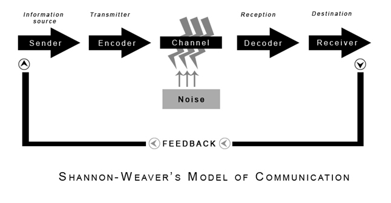

Title: AI opportunities need improved Spec Driven Development with TLA+
Date: 2026-05-02 12:33
Tags: ai, llm, qa, tla, sdd

[TOC]

# Ambiguity in the Era of AI

> "Record who fed her cat food"

*Is it a human eating cat food, or is it a human feeding a cat? Record with video, or write it down?*

English is infamously imprecise - which is a challenge when writing software requirements.

Throughout my software career, I've lived through so many telephone games:

> Customer/User -> Support -> Product Manager -> Engineer

LLMs are not a silver bullet, they amplify existing systems.

Ambiguity and imprecision become an LLM over-engineered ProductRequirementDocument (so many paragraphs of such long sentences, absolutely!), followed by AI Agents that auto-generate an exponential number of (obfuscated, contradictory) JIRA tickets.

A waste of time, tokens (dollars!) - and worse, finite human attention.

**Using an electric car, to pull a combustion engine, that is pulling a wooden cart... with a horse sitting in the cart.**

# Spec Driven Design

An increasingly popular approach to constrain and leverage LLMs in code generation is to be more precise in specifying what we want: <https://martinfowler.com/articles/exploring-gen-ai/sdd-3-tools.html>

This practical application has strong foundations in computer science theory:

[Shannon's "information theory"](https://en.wikipedia.org/wiki/Claude_Shannon#Information_theory) and [Hamming codes](https://en.wikipedia.org/wiki/Richard_Hamming#Bell_Laboratories) provide precise terminology and clear thought allowing mathemtical quantification of signal-to-noise ratios and error rates in communication.



## SDD Gaps

Spec-Driven Design does not have a mechanism to distill english into unambiguous precision, nor does it have a method of enforcing behavior/implementation.

Practically: copy pasting the each absurdly wrong auto-generated jira ticket (ok - your Agent has MCP so it ingests them automatically) will never be "correct", it will not deliver value, and worst of all... 

Building the wrong thing quickly will waste everyone's time and patience.

Cue super hero: [*Leslie Lamport (Turing Award Winner and creator of TLA+)*](https://en.wikipedia.org/wiki/Leslie_Lamport)

> One reason for modeling a system is to check if it does what we want it to

What if you time-traveled decades before LLMs and created a precise language that provides deterministic strong guarantees about software?

# Human Intent Matters

Now that (with LLMs and coding agents) writing and changing code is easy, let's tackle the really hard part: writing specifications.

Extracting the correct invariants takes deep focus - but it is truly the unique human role to provide intent.

Here's what invariants look like for a real project — a "software professional personality" quiz game I'm building:

```
INV-001: There is at least 1 personality type
INV-002: Every personality type has at least 1 source link
INV-003: Each question has at least 1 answer
INV-004: Each question references a source
INV-005: Every question modifies at least one score
INV-006: Each personality type must be reachable
```

These can be verified across all possible states, and the last one is critical: ensuring there is a path of answers that can lead to every personality type.

## Imperative vs Declarative

Infrastructure as Code (IaaC) already went through a similar process of shifting from a series of How steps to simply stating "it is this".

**Imperative**: "Start a server, run updates, install the firewall, install the nginx webserver, copy configuration..."

**Declarative**: "A server exists with a single network port exposed, running a webserver configured via nginx.conf"

Applying this declarative mindset to an improved Specification workflow:

- Humans state the invariants
- Software (LLMs) translate english invariants into a formal specification
- A deterministic model checker verifies the specification for logical correctness
- then leverage the best of Spec-Driven Development to write an implementation and execution plan
- Agentic coding (with harness and skills) implement
- [Verify via automated tests and auditing log statements]


# An evening with TLA+

I've wanted to learn TLA+ for years but got stuck on academic formalism, the dense mathematical syntax, and the complex toolchain.

This time I paired with an LLM: learning and building, up and running in an hour.

I gave Claude my six English invariants and asked it to generate a TLA+ specification, absolutely!

Codex parsed the spec and even ran the model checker for me. Success!

## Learning to harness the invariant approach

**AI Over-Engineering** happened: the eager LLM generated a spec with sixteen constants including Bayesian posterior probabilities, expected information gain calculations, and an adaptive question engine. Features I hadn't really specified yet.

It's a QA best practice, especially with new tools/techniques, to deliberately break something and see the expected failure. This helps avoid vacuous or tautology tests - things that do nothing but "pass/succeed".

(Thanks to an LLM suggestion of exactly where/what to change)... I changed the test data so a question contributed zero points to any score, INV-005 says every question must modify at least one score, so this should have failed.

```
Finished computing initial states: 0 distinct states generated
Model checking completed. No error has been found.
✔ Success
```

**Zero states generated - no error has been found** - subtle and silent failures are gotchas when working with LLMs.

### Multiple Fixes - governance

I added three rules to my AGENTS.md to strengthen governance and enforce simplicity:

```
1. Every predicate in a TLA+ spec traces to a numbered INV-xxx in INVARIANTS.md. No extra predicates.
2. The model file contains only literal test data.
   If a value depends on other constants, define it as an operator in the spec, not a constant in the model.
3. A TLC run that generates 0 states is a failure. Report it as an error and diagnose.
```

The AI re-read the rules, looked at its own output, and flagged itself:

> "The TLA+ model file is not literal-only. CReachableOutcomes == CPersonalities is a derived value, not literal model data."

After the LLM cleaned up and regenerated the TLA files, the model shrank to pure literals.

Then to deliberately break it I zeroed out all scores for one question and re-ran:

`uv run tla tlc RandsPersonalityGameInvariantCheck.tla`

> **The invariant of INV005 is equal to FALSE**

So I successfully forced an error - and revealed a design bug.

## Learning about Weakness

> INV-005: Every question modifies at least one score

Thinking through what's wrong with the logical model I read the "test cases" and realized that if the first question's score was very high for a personality, then following questions that only changed the score a tiny bit would never alter the final outcome.

The user would (unwittingly) answer a lot of questions for no appreciable difference.

So I had to improve my spec

```
INV-005: Every question can change the outcome
For each question, there exist answer choices that produce different final personality types.
```

# Summary

TLA+ is a powerful tool that gives you more predictability and certainty, before you unleash the chaos of LLMs.

LLMs "raise the floor" so anyone can use invariants to build reliable systems (instead of leaping headfirst into vibe coding an unmaintainable buggy mess). The system should leverage information theory, not be a victim of the noise.

And LLMs are not only translators, they are tutors to help you improve on the unique human role of specifying the Intent.

Of course, also "trust but verify": Nothing tested so no errors found. Reward hacking. Over-engineering. This all means the human is ultimately the judge - less time spent on the How and more on "is this the right What"?


# Appendix - Learning TLA+

## Background on TLA+

"Temporal Logic of Actions", TLA+ is a (formal specification ) language for modeling software, based on temporal logic and set theory.

- <https://lamport.azurewebsites.net/tla/high-level-view.html>
- <https://www.wired.com/2013/01/code-bugs-programming-why-we-need-specs/>

Basically: Initial states -> Allowed transitions -> Properties to verify

It lets you describe:

- States of a system
- Transitions between states
- Safety properties ("nothing bad happens")
- Liveness properties ("something good eventually happens")

Tools can then check the specification and mathematically verify its properties.

TLA+ is used in industry by AWS, Microsoft, and other places requiring extreme reliability.

*It’s especially popular for consensus algorithms, distributed protocols, locking systems, etc.*

- <https://lamport.azurewebsites.net/tla/industrial-use.html>
- <https://lamport.azurewebsites.net/tla/formal-methods-amazon.pdf>
- <https://cacm.acm.org/research/how-amazon-web-services-uses-formal-methods/>
- <https://conf.tlapl.us/2019/yannickwelsch/> (Elasticsearch)


## Writing a simple spec

What if you wanted to ensure a bank account never went below 0...

```tla
---- MODULE BankAccount ----
EXTENDS Naturals
VARIABLES balance

Init == balance = 0
Next == UNCHANGED balance
INV001 == balance >= 0
====
```

- "Naturals" is the library for numbers
- Initially balance is 0
- Next state is to do nothing
- The invariant is the balance has to be non-negative

### Breaking Bad

Hey, a feature request: Decrement the bank account...

```tla
---- MODULE BankAccount ----
EXTENDS Naturals
VARIABLES balance

Init == balance = 0

Decrement == balance' = balance - 1
Next == Decrement

INV001 == balance >= 0
====
```

**Decrement** describes that **balance'** has the new state.

And when Next occurs, we decrement: is the Invariant still true?

### Checking the spec - enforcing invariants

> [Please excuse the yak shaving...](<https://projects.csail.mit.edu/gsb/old-archive/gsb-archive/gsb2000-02-11.html>)

<https://seths.blog/2005/03/dont_shave_that/>


Tooling: **TLC is a Model checker**

```bash
brew install openjdk


java -version

uv init --bare
uv add --dev tlaplus-cli
uv run tla --version
uv run tla tools install

export PATH="/opt/homebrew/opt/openjdk/bin:$PATH"
uv run tla check-java
```

So after all that...

**BankAccount.cfg**
```
INIT Init
NEXT Next
INVARIANT INV001
```

`uv run tla tlc BankAccount.tla`


```
Running TLC (TLC2 Version 2.19 of 08 August 2024 (rev: 5a47802)) on BankAccount.tla ...
Starting SANY...
Parsing file /Users/.../BankAccount.tla
Semantic processing of module Naturals
Semantic processing of module BankAccount
SANY finished.
Finished computing initial states: 1 distinct state generated
Invariant INV001 is violated.


Finished in 245ms
✖ Error: Model checking failed with 1 error(s).

```

> The human has to think logically about happened

*JAVA_HOME=/opt/homebrew/opt/openjdk uv run tla check-java*
*(~/.zprofile or ~/.bashrc) export PATH="/opt/homebrew/opt/openjdk/bin:$PATH"*

### The fix - ask an LLM

Paste the spec and the TLC error into your favorite LLM and ask for the simplest fix.

```tla
---- MODULE BankAccount ----
EXTENDS Naturals
VARIABLES balance

Init == balance = 0


Decrement == balance > 0 /\ balance' = balance - 1
Next == Decrement \/ UNCHANGED balance

INV001 == balance >= 0
====
```

- A logical AND is represented with `/\` so the balance has to be greater than 0 AND then subtract
- A logical OR is represented with `\/` so the Next step will either decrement or not change the balance

Therefore we have fixed our model to not decrement when the balance is 0.
