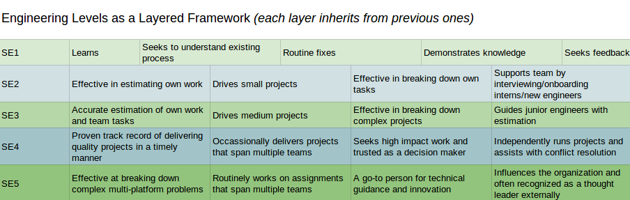

Title: Career Development and Software Engineering Roles
Date: 2018-12-31 12:34
Tags: career, engineering, roles, software, management

[TOC]

## Career Development is Vague but Heavy

It can be vague where someone's career was before they met you and how **they** view their long term ambitions.

And when the work is getting done **now** it is easy to understand why **future** Career Development is one of the overlooked aspects of management.

Knowledge workers have a lot of job choices: if their current trajectory won't help them meet their life goals they will make changes that may come as an unwelcome surprise to their manager or organization.

Aligned interests, beyond salary-for-output *(it would be even better if it was compensation-for-outcome)*, is one of the simpler ways to improve a product and reduce the costs of turnover. *(i.e. <https://en.wikipedia.org/wiki/Peopleware:_Productive_Projects_and_Teams>)*

### When to discuss Career Development

One of the best tools for building relationships are 1:1's.
*("Manager Tools" <https://files.manager-tools.com/files/public/product-samples/One_on_One_Shownotes_0.pdf>)*

At least once a quarter *(aka 3 months)* a 1:1 session should cover Career Development. *(i.e. a regular opportunity to align Company/Team Objectives or Goals with the individual's career)*

One of the first questions I generally ask is `"Where do you want to be in 2 years?"`
> 2 years is just long enough to be aspirational but near enough we should be planning together how to get there

*"Where" should not be reductively just about salary, instead it should encompass talent + experience + direction.*

As a caveat, even the largest companies will not have every type of role possible.
A good manager will provide guidance about what is immediately available (and research future possibilities).

> Great managers grow careers even when it means the outcome will be an individual changing teams or organizations

 

## An incomplete list of technology roles
There are too many roles related to technology to list them all but here are some important ones...

### Software Engineer
- **Front End Engineer**: works mostly with implementing UserInterface features and bug fixes *(frequently using Javascript and including HTML and CSS)*
- **Mobile Engineer**: sort of a specialist "front end engineer" (assuming you agree that the focus is on Users), ideally experience with both iOS and Android but usually specializes in one
- **Fullstack Engineer**: someone who can write/fix "front end" and "back end" code, often a generalist given the necessity of context switching between so many frameworks
- **Backend Engineer**: specializing in APIs, Services, and often data storage (i.e. databases, files, etc.) - by contrast less focus directly on Users

*Web Engineer is a less common title as there is less need to distinguish from a Desktop Engineer =p*

 

#### Software Engineering gradations by years of experience

These levels/titles are really fuzzy because the years may more directly relate to time in an organization or specifically to a framework/techstack.

*Also, with talent and extreme focus/specialization someone within 2 years can be producing at the level of a "principal engineer"*

- **Junior** *(<2 years)*: focused on implementation under supervision
- **Senior** *(~between 2 and 5 years)*: able to independently gather requirements and run a project from start to finish
- **Principal** *(>5 years)*: influence at the organizational level

Generally it gets exponentially harder to "level up" *(it would be exceedingly rare to have an organization that is all principal engineers)*. Interestingly, given the investment in time, training, and supervision required for junior engineers, it is also rare to have a "pyramid" shaped engineering organization.

*One caveat: a Software Engineer will apply best practices in creating solutions and systems (i.e. bigger picture complexity and scale), whereas a Programmer title hints at a more "limited to code" role.*

##### Example Diagram of Engineering Levels

### Operations
Technology roles supporting the actual running of software and services...

- **SiteReliabilityEngineers (SRE)**: automating monitoring and stability as applied expertise via code *(<https://en.wikipedia.org/wiki/Site_Reliability_Engineering>)*
- **DevOps**: automating the operations of systems and services (including monitoring, scripts and code writing, etc.) - leverages Dev skills with Ops experience *(<https://en.wikipedia.org/wiki/DevOps>)*
- **Operations**: maintaining services/systems (hopefully still using automation and ideally transitioning to DevOps due to increased scale)
- **System Administrator**: manual job of maintaining a small number of (virtual or physical) machines/systems

 

### Data
Information has to be stored somewhere, this specialization has become even more prevalent with the exponential growth of "big data"...

- **Data Scientist**: someone who uses mathematical tools like statistics, in conjunction with software and "big data", to answer questions *(or discover insights)*
- **Data Engineer**: someone who builds infrastructure and tools that enables "Data Science", i.e. pipelines, warehouses
- **DBA (Database Administrator)**: someone who manages the data for an organization, often an expert in the tooling and optimization

 

## Lateral Moves
Sometimes, besides all the levels and specializations, there are changes in career track *(significantly different responsibilities and focus)* that are big enough to be called a "lateral move".

- **Architect**: larger systems are inherently complex and designing and communicating the interfaces, especially across multiple teams/services, is an essential "big picture" role
    - *Having eng experiences leads to designs with fast and effective implementations and prevents "ivory tower"*

- **Engineering Manager**: people are non-deterministic, they cannot be debugged, and yet they are a part of every successful organization.
Someone who takes care of people, helps build and keep a team running smoothly, and achieves company outcomes. This is usually the role before Director and VP
    - *Having eng experience vastly increases credibility and the ability to estimate and deliver*

- **Quality**: someone who methodically thinks outside the box and regularly breaks boxes, ideally the most valuable boxes first
    - *Having eng experience means awareness of common shortcomings in frameworks/code and certain boundary conditions or real world scenarios (i.e. load)*

- **Security**: someone who thinks way outside of the box and finds ways to get inside of locked boxes
    - *Having eng experience allows for familiarity with architecture/framework/code flaws and automation of exploits*

- **Product Manager**: someone with passion and organizational skills who drives a product forward into the world
    - *Having eng experience allows for clearer and faster scope/timing discussions, and the ability to help the team with design or debugging*

- **Designer**: someone who loves the User and UI/UX and delivers highly desirable features and products
    - *Having eng experience allows for more effective collaboration and reduced time to market*

## Other Important Aspects
Career Development is not just getting the next position, it should also be about a lot of qualitative skills that lead to success:

- **Listening**: hearing Users, Stakeholders, Teammates, etc. is one of the most important parts of solving the right problems
- **Communication**: proposing good solutions, asking hard questions, raising concerns, writing skills
- **Time Management**: individual deadlines, team success
- **Interviewing**: being an interviewer is a completely different specialization - yet hiring cannot succeed without good technical interviewers
- **Business**: understanding impact and the consequences of outcomes
- **Teamwork**: multiplying the efforts of those around you

For each skill it is worth considering:

1. What is the individual's current level?
+ How important is it to them to improve?
+ What resources can be provided?
+ How will they be encouraged and held accountable for progress?

Did I miss something? Are there missing nuances or outright incorrect statements?  Of course! =)
> There is no one-size-fits-all definition to this NP-Hard problem of "people and organizations over time"

## Iterative Improvement on this Article
My brash/blunt style is apparent in this article, but for a peek at how much better things get with collaboration and an editor check out the polished version:

<https://web.archive.org/web/20200415071712/https://blog.helix.com/helping-your-engineers-grow/>

Also, I have later stumbled across this similar idea of "the range of software careers" done as a podcast back in 2008:
- <https://www.se-radio.net/2008/09/episode-110-roles-in-software-engineering-i/>
- <https://www.se-radio.net/2008/09/episode-112-roles-in-software-engineering-ii/>

