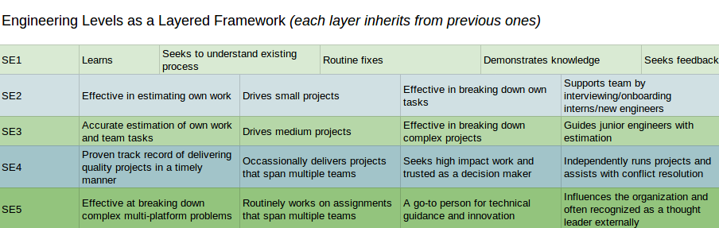

Title: Career Development and Software Engineering Roles
Date: 2019-01-01 12:34
Tags: career, engineering, roles, software, management

[TOC]

This same article is published at **<https://web.archive.org/web/20200415071712/https://blog.helix.com/helping-your-engineers-grow/>** *with images!*

As a manager, it can be unclear where someone’s career was before they met you and how they view their long term ambitions. And when the work is getting done now, it is easy to understand why *continued* career development is one of the overlooked aspects of management.

When you understand their ambitions you can more effectively align their interests with those of the company. This has the positive effect of engaging the employee and may be more important to them than a simple "salary focused" career discussion.

Hopefully the following ideas provide some topics to cover during your next career development discussion.

# When and why to discuss career development

One of the best tools for building relationships between employees and their managers is the one-on-one.

[To learn more about one-on-ones, I recommend "Manager Tools", one of the longest running and most informative management podcasts.](https://files.manager-tools.com/public/product-samples/One_on_One_Shownotes_0.pdf) 

At least once a quarter, a 1:1 session should cover career development (i.e., a regular opportunity to align company, or team, objectives with the individual’s career goals before they drift too far apart).

> Great managers grow careers, even when it leads the individual to another team or organization

One of the first questions I generally ask is, "Where do you want to be in two years?" Two years is just long enough to be aspirational but near enough that we should be planning for it.

"Where" should not be reductively just about salary—instead, it should encompass talent, experience, and direction. After a certain point, people need more than money to achieve happiness (as described by Daniel Pink in "Drive" and studied by Kahneman and Deaton). From this perspective, a career can be thought of as the arc of daily work aggregated into some meaningful vector.

> As a caveat, no company, not even the largest ones, can have every possible role. A good manager will provide guidance about what is immediately available, help them research future possibilities, and find ways to expand their current role.

 
Career development is not just about getting the next position, it should also be about discussing and developing the qualitative skills that lead to success. By proactively discussing the following "soft skills" with your direct report, you will ensure they have the right tools to succeed in their current and future roles.

- **Listening**: Hearing what others (users, stakeholders, teammates, etc.) are saying is one of the most important parts of identifying the right problems and finding a way to solve them.
- **Communication**: Proposing good solutions, asking hard questions, raising concerns, writing in a clear and compelling way—these are all important forms of communication that often lead to learning opportunities.
- **Time Management**: Being able to prioritize individual deadlines can lead to both personal and team success.
- **Interviewing**: Being an interviewer is a completely different specialization, yet hiring cannot succeed without good technical interviewers.
- **Business**: Understanding the impact, and its potential outcomes, of any given role can go a long way towards informing a person’s daily decisions.
- **Teamwork**: A rising tide raises all ships. Learning how to multiply the efforts of our coworkers can go a long way towards advancing each of our careers.

For each skill it is worth considering:
*1. What drives or motivates the individual?*
*2. What is the individual’s current level?*
*3. How important is it to them to improve?*
*4. What resources can be provided?*
*5. How will they be encouraged and held accountable for progress?*

---
# An incomplete list of technology roles

So, what other topics can you discuss with your direct report in a career development conversation?

One major focus area is their role in the organization, identifying what they are doing now and what they would like to do next. Sometimes growth isn’t about moving up the "vertical" org chart but instead specializing in a specific kind of work or moving laterally into a different domain.

# Software engineering gradations

These levels/titles are generalizations (since every company is different) for the progression ("vertical") a person goes through as they mature and grow:

- Junior: Focused on implementation under supervision
- Senior: Able to independently gather requirements and run a project from start to finish 
- Principal: Influence at the organizational level

Generally it gets exponentially harder to "level up" (it would be exceedingly rare to have an organization that is all principal engineers). Interestingly, given the investment in time, training, and supervision required for junior engineers, it is also rare to have a pyramid-shaped engineering organization.

# Software Engineers

There are too many roles related to technology to list them all, but here are some important specialization titles related to Software Engineering.

- **Front End Engineer:** Works mostly with implementing user interface features and bug fixes, frequently using Javascript and including HTML and CSS
- **Mobile Engineer:** Sort of a specialist front end engineer (assuming you agree that the focus is on users), ideally having experience with both iOS and Android but usually specialized in one.
- **Full Stack Engineer:** Someone who can write/fix front-end and back-end code, often a generalist given the necessity of context switching between so many frameworks.
- **Backend Engineer:** Specializing in APIs, services, and often data storage (such as databases, files, etc.)—areas less focused on users.
 
> *One caveat: a Software Engineer will apply best practices in creating solutions and systems (including bigger picture complexity and scale), whereas a Programmer title hints at a more "limited to code" role.*

# Operations

These are common examples of technology roles supporting the running of software and services:

- **Site Reliability Engineers (SREs):** Automating monitoring and stability as applied expertise via code. [More on this here](https://web.archive.org/web/20200415214648/https://en.wikipedia.org/wiki/Site_Reliability_Engineering)
- **DevOps:** Automating the operations of systems and services (including monitoring, scripts and code writing, and so on), leveraging Dev skills with Ops experience. [This wiki page has some good info on this](https://web.archive.org/web/20200424230047/https://en.wikipedia.org/wiki/DevOps)
- **Operations:** Maintaining services/systems (hopefully still using automation and ideally transitioning to DevOps due to increased scale).
- **System Administrator:** A manual job of maintaining a small number of virtual or physical machines/systems.

# Data

Information has to be stored somewhere, which is where data roles come into play. This specialization has become even more prevalent with the exponential growth of "big data."

- **Data Scientist:** Someone who uses mathematical tools like statistics, in conjunction with software and "big data," to answer questions (or discover insights).
- **Data Engineer:** Someone who builds infrastructure and tools that enable "Data Science"—pipelines and warehouses, for example.
- **Database Administrator (DBA):** Someone who manages the data for an organization, often an expert in the tooling and optimization.
 
 ---
# Lateral Moves

Sometimes, besides all the levels and specializations, there are changes in a Software Engineer’s career track (significantly different responsibilities and focus) that are large enough to be considered a "lateral move." These can include:

- **Architect:** Larger systems are inherently complex and designing and communicating the interfaces, especially across multiple teams/services, is an essential "big picture" role. Having engineering experiences leads to designs with fast and effective implementations and prevents "ivory tower".

> Having engineering experiences leads to designs with fast and effective implementations

- **Engineering Manager:** People are non-deterministic—they cannot be debugged, and yet they are a part of every successful organization. Engineering Managers are individuals who take care of people, help build and keep a team running smoothly, and achieve company outcomes. This is a potential first step towards becoming a Director and eventually a Vice-President. Having engineering experience vastly increases credibility and the ability to estimate and deliver projects.

- **Quality:** Someone who methodically thinks outside the box and regularly breaks boxes, ideally the most valuable boxes first. Having engineering experience means awareness of common shortcomings in frameworks/code, certain boundary conditions, or real world scenarios (i.e. load).

- **Security:** Someone who thinks outside of the box, way outside, and finds ways to get inside of locked boxes. Having engineering experience allows for familiarity with architecture/framework/code flaws and automation of exploits.

- **Product Manager:** Someone with passion and organizational skills who drives a product forward into the world. Having engineering experience allows for clearer and faster scope/timing discussions, and the ability to help the team with design or debugging.

- **Designer:** Someone who champions the User and delivers highly desirable features and products through UI/UX. Having engineering experience allows for more effective collaboration and reduced time to market.

# Finding Opportunities

Open conversations with direct reports about their direction and interests allows management to find ways to accomplish the company’s goals while simultaneously develop their people.

If one of your direct reports is interested in learning more about cloud or serverless architectures, look for upcoming projects where they can work to gain experience leveraging AWS (or Azure, or Google Cloud). Having them not only code, but also contribute to internal documentation on the subject allows the organization to be productive, enhance capabilities, and pave the way for future engineering efforts.

 
> Visibility into the interviewing process is a valuable learning opportunity

And, maybe someone on your team wants to learn more about interviewing, which is an important skill for leading and scaling a team. You can facilitate this by: Providing your direct report with materials on best interviewing practices (from both within your organization and from external sources); doing a role play interviewing session with them; having them silently observe ("shadow") existing interviews; and having them start pairing on resume screens, phone screens, and on-site interviews. Visibility into, or participation in the interviewing panel and the post-interview debriefs is also a valuable learning opportunity. Finally, use your 1:1s to review the new skills they have learned and how this contributes to the company’s success.

In an extreme example where an individual is pushing for a lateral move into a product management role, there are more than a few ways to help them. Here are some common and simple steps you can take: Set them up with opportunities to shadow an existing PM, have them run a meeting, get them to write up a project proposal (focusing on the value propositions over the engineering implementation), or simply have them practice public speaking by presenting to a larger, cross functional audience from the company. Remember: Their contributions, even outside of writing code, are still valuable to the success of the company.

Opportunities are not about guaranteeing success, but instead about providing value to the employee that they cannot buy or potentially find elsewhere.

# Summary
Focusing on people is the most important aspect of management. Understanding how they fit into an organization and aligning how their individual careers (and skills) weave together to create a sustainable team requires investment. Spending dedicated time and having a shared vocabulary and a shared understanding is crucial to keeping good talent.

Developing your people creates a "stickiness"—a unique bond that creates a "win-win" environment—where their career progresses and the company has more skillful and motivated employees.
