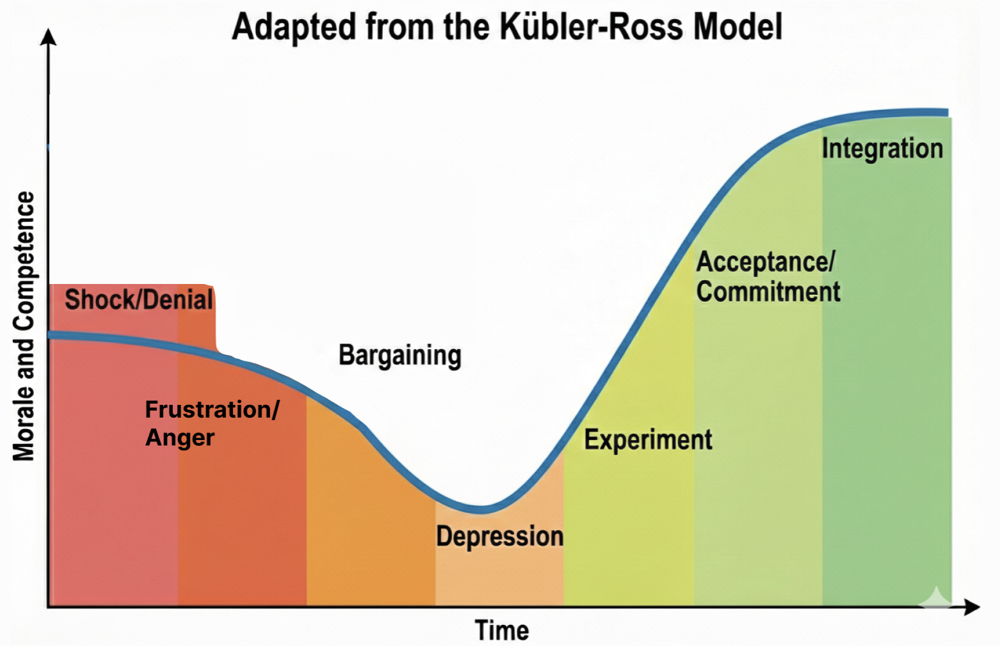

Title: One of the hardest parts of the job - Layoffs
Date: 2024-02-29 12:01
Tags: career, engineering, management, leadership, director, navigating change

[TOC]

*Disclaimer: this piece reflects my experiences and is not legal or professional advice.*

# It happens

I've been through multiple layoffs: some I delivered, some I narrowly avoided being on the receiving end. It is never easy, never painless.

This can happen to any kind of company: a startup that runs out of runway or has to pivot, or a large company making a "strategic change." Sometimes it's a broader shock like the 2008 financial crisis or the COVID-19 pandemic.

Even if it hasn't happened directly to you, it has probably happened to someone close to you: a partner, a family member, a close friend, or a former colleague.

## Stabilize yourself first

During layoffs, start by acknowledging it is understandable that you're going to have feelings about this.

A useful parallel is the Kubler-Ross model of stages of grief. The point is your emotional state affects your judgment, your patience, and your capacity for the hard decisions and difficult conversations ahead.

Shock and denial: "Maybe we don't really need to do this. Maybe Q4 will turn around." 

Then frustration and anger: at the situation, at the leadership decisions that led to this, at yourself for not seeing it sooner. Feeling like some performance issue could have been addressed earlier.

Bargaining: maybe people can work extra on weekends, or temporarily take pay cuts, and the problem will go away.

Then a low period where everything feels heavy, normal work feels impossible.

As these emotions play out, don't make decisions yet, as your judgment isn't reliable. Instead gather facts and prepare to think clearly.

At a high level, consider 3 phases:

- **Planning:** understand the problem, gather data, plan with options
- **Decision:** commit and follow through
- **Integration:** help the new organization stabilize and become healthy

*This is one of the ultimate tests of your capacity for confidentiality: leaking your thoughts and emotions early will create anxiety and chaos.*

### Managing Up

This is an advanced career move, so not for everyone, (and be mindful of your emotional state if you decide to attempt this) but if you have built up enough trust, double check with your manager:

- Is this really necessary? (These kinds of changes can have unintended side effects, can lead to irrevocable loss of morale)
- Will this be multiple rounds? (longer timeframes means more paralyzing and demoralizing)
- Who else will be involved in the planning, and can I discuss it with them?
- Do you already have a list in mind?

Be very careful to not sound like you're questioning leadership; seek to understand so you can achieve the best outcome.

Going through these questions may help you have more complete answers and be anchored as you begin the difficult work.

# Planning: Work Backwards from the Goal

If the problem is bad enough that it requires a reduction in force, waiting months or even weeks is unlikely to improve things.

Urgency doesn't mean reckless. These are some of the most critical, life-impacting decisions you will make.

Prioritize thinking and working on this before almost anything else - the people affected deserve the best from you. Do it in a quiet, private space.

To be clear: you need a healthy organization of teams at the end to get good results.

> Start with the outcome: what does the successful organization look like after?

Work backwards from there...

## What does the Future Org look like?

An understandable misstep is to focus on who to remove rather than what you're tasked with building.

Don't start from your existing org, it may have grown organically over time or hastily during a hiring boom. Think outside the box. Start with answering key questions:

- What are the most critical projects that have to continue?
- Are there natural domains or boundaries around the key initiatives?
- What skills/support are most needed?

Conway's Law points out that the product (or software) will mirror the organization that builds it. <https://en.wikipedia.org/wiki/Conway%27s_law>

Similarly, when you understand the shape of the future work, it should inform how you shape your new organization.

A RIF is an unpleasant forcing function: consider the really painful and radical ideas first, sometimes they're right and dismissing them limits your options.

- Look to create teams that own clear domains with minimal external coordination
- - prefer clear end-to-end autonomy and value delivery
- Consider retaining deep expertise, but balance it against future potential
- Prioritize high morale and high productivity: the road ahead will be bumpy

Then layer in:

- Are there clearly areas that are lower priority/impact?
- Places the business can no longer justify?

Consider your ideal team size: often less than four is fragile (PTO, sickness, on-call coverage), and greater than ten struggles to focus (mega standups, orthogonal sub-projects). 

Use a confidential whiteboard; brainstorm and be open to a lot of paths, options, and variations.

I remember talking with my counterparts in other disciplines and departments. Having so many hard conversations about what they were seeing and thinking about. Drawing and redrawing so many variations to not miss a possible improvement.

*And some more resources on org planning:*

- *<https://se-radio.net/2024/02/se-radio-601-han-yuan-on-reorganizations/>*
- *<https://sfelc.com/podcasts/how-to-do-an-effective-re-org-aaron-erickson-orgspace-mike-tria-atlassian>*

---
# **Gathering Data**
Gather data, both objective and subjective, into one confidential place.

You will need data to show yourself, your leadership, and most importantly, your direct reports that you were as thorough as possible.

- What is the driver of the RIF: financial, strategic, or something else?
- Every person's current tenure and salary
- Performance Reviews and OKRs
- Previously created succession plans
- Past, present, and future Roadmaps. Plus agile sprint data or charts
- An inventory of all responsibilities, special skills, critical external relationships
- Emotional data can look like "Which 1:1s do you dread? Which do you look forward to?"
- Who's engaged in meetings, taking initiative, amenable to coaching?
- Who's been actively cross-training, and is adaptable enough to do more?

## Building Careful Systems of Evaluation

Consider starting with a simple table of every name.

Add columns of attributes: Productivity, Cost, etc.

*Customize to the attributes that make the most sense to you and your org*

Stack-rank the attributes by priority (or add "weightings") - not all data is equal.

Then for each person, add a score of 1 to 5 for each cell: this pseudo-numerical system isn't meant to absolve you of the fact you're making the decisions, but to force you to recognize what you're prioritizing.

I found using positive attributes in the scoring was difficult because I wanted to give everyone a top score.

Looking at negative attributes is more uncomfortable, but also more revealing in this context. It forces you to face the difficult tradeoffs when the work ahead is about to get harder.

Example Table (high score is worse)

| NAME     |  DISRUPTIVE,  | LOWER PRODUCTIVITY, | NEEDS SKILLS DEVELOPMENT,  | REQUIRES MANAGER ENERGY, | COST, | SUM |
| ----------- | ----------- | ----------- | ----------- | ----------- | ----------- | ----------- |
| Alice   | 1    | 2 | 4 | 3 | 2| 12 |
| Bob     | 5    | 3 | 1 | 3 | 4| 16 |
| Charlie | 3    | 5 | 2 | 2 | 2| 14 |

Then iterate again on all the values. Sort and re-sort from different angles.

Next try adding a "safe list" approach: start with the nucleus of your future successful org. (Move them to a separate spreadsheet).

Consider second-order effects: who might be demoralized or leave due to the layoffs.

Like when interviewing a great candidate who doesn't quite fit: this is more about the future organization, its priorities, and possible financial constraints than the individual's qualifications.

Also future team chemistry matters as those remaining need to pull together and push forward.

Will you need as many managers? How will new reporting structures work?

Never delude yourself that the system will give you the answers and absolve you of the decision making responsibility.

Listen to your instincts, not because they're always right, but because maybe they're telling you something you don't fully understand yet.

Spend time reflecting and getting more data when something feels off.

## Know the limits of what you know

Having a really complex system and fancy models doesn't mean you can predict the future. Often too much complexity gets in the way.

And here's a really hard thing: do not involve an individual's personal situation.

You can tie yourself in knots thinking about each person's life consequences. Worse, you likely don't know everyone's full situation: family and dependents, expecting children, mortgage and debt, immigration status, etc.

If you start making exceptions where will you stop? Is it fair to the people whose situations you don't know?

The professional role of a people manager is evaluating people's professional circumstances.

## Another Evaluation Framework

Another useful framework comes from criteria Jim Collins lays out in "Good to Great":

- How would you feel if the person quit today?
- Do you risk losing others by keeping this person?
- Are there concerns about their values, willpower to get things done, or skills?
- When things go wrong, do they look to blame, or in the mirror to improve? 
- Have they been giving you signals like "this is just a job"?
- Do you have them in the right seat on the bus?

> Did your bus just get a lot shorter?

*Do not be surprised if you are also on a list, even if it's not today*

# Get Feedback

You are not doing this in a vacuum. All of your research and planning is part of a larger process.

As you reach out to people for feedback, remember to be careful: this is "need to know" only. Only bounce ideas off people you can trust with confidentiality.

Consider having some meetings "off calendar". Be cautious about how you share any lists or plans. Premature sharing can lead to rapid and uninformed decisions.

## An open mind for the best outcome

Do be open-minded to different viewpoints. This is about the best possible outcome, not your ego.

Sometimes saying something out loud reveals a very good, or very bad, idea.

Can you be vulnerable and admit if you have favorites? Why might you feel a certain way?

Before you finalize anything: has someone spotted an unconscious bias? Are there unique permissions or access you may have missed?

What's your second-tier succession plan, and how will you cover if others quit?

How will the chemistry change between teams and groups?

Are there responsibilities someone in your group can take over elsewhere in the org? Could there be trades with other managers?

These extra conversations require discretion but can sometimes help retain one more person; this can make all the difference.

---
# **Decisions**

Once you've made the decision, stop "looking for more signs" to confirm or deny it. You've done the work.

Do stay open to truly last-minute information: someone resigning or otherwise exiting, a material change in the company's plans or needs.

You still need to keep this all confidential, which means trying to avoid a change in behavior or hints. The hardest part is yet to come.

## Logistics

Figure out when the decision is final. From there, figure out when is the soonest you can deliver the news well. Note that HR, Legal, Admin, IT, and other departments will need some time to prep too.

Try to keep the gap short: days, not weeks. Long delays create anxiety, speculation, and distraction.

Plan to do it all at once. This may take most of a day, or more. The decision maker should deliver the news privately to each person affected. Be thoughtful of how many people are "in the room" when someone receives news like this.

*If it's not possible to do in person, make sure IT is ready for the series of private video meetings.*

In many places, leaders prefer to communicate layoffs at the end of the week, with no further work expected that day, so people have private time to process. They should not be expected to absorb life-changing news and then return to a normal workday.

That also means everyone supporting the process should be ready for immediate next steps once the conversations start.

### Terminating Access

The goal is not to treat people as untrustworthy. Once someone has been told they are leaving, the organization needs a clean and immediate transition point, especially on a day that may already be emotional and chaotic.

This reduces confusion, avoids accidental mistakes, and makes it clear who is responsible for what from that moment on.

Coordinate with IT, HR, Legal, and others on things like:

- Production Systems, Production Data
- Confidential or Sensitive info
- Public-facing communication channels used on behalf of the organization

On the day of, this may expose gaps in your preparation. In that uncomfortable event, it is better to reduce activity and access, then review it more thoroughly when things are less busy.

*If someone needs to keep limited access for a short time, that should be a rare, intentional exception with a clear reason behind it.*

### Who Knows When

Keep this confidential from everyone inside (and outside) the company who doesn't absolutely need to know.

Sync with your peers and HR who are planning and handling the changes. You're all designing the future successful org. They're your support group during this difficult time.

Rumors may already be swirling. Don't be rushed. You may have to honestly say "I don't have any answers for you right now".

# Communications Plan and Delivery

Have a **Communications Plan**. Each sentence and every word should be carefully reviewed.

During layoffs, this should not be communicated as a personal criticism, or framed like a performance review. There are a lot of factors that go into the decisions. Make sure your language doesn't imply that it's about performance.

For instance, if the company is no longer doing hardware, then excellent people who are experts in hardware will be let go.

Plan down to the minute which people or teams are notified. Prioritize informing those most affected first.

Double-check that the formal parts are ready: this is an extremely emotional one-way door. Not the time for administrative mistakes.

What answers have HR prepared for handling situations like visa issues, parental leave, or other specific circumstances with compassion?

Triple-check your understanding of the new org structure, including connections to other teams, which responsibilities must transition, and especially passwords, credentials, and external contacts.

Prepare a FAQ: what are people most likely to ask or be worried about?

- Will those leaving get severance and benefits?
- Am I allowed to reach out to folks personally?
- Who made the decisions?
- Why is this happening?

Rehearse and practice your delivery: both to those who will be departing, and the message you'll be giving to those who remain.

## The Day Of

*Try and be rested beforehand: this is a really sad day and takes a lot out of you emotionally.*

Dedicate a whole day to delivery. Nothing else on your calendar. 

**There will be no productive work this day. Accept it.**

### For those departing

If someone is out on vacation or medical leave, delaying communication can create its own harms: they may hear a distorted version secondhand, lose time to process next steps, or be left in limbo while others already know.

In practice, this is usually something to handle carefully with HR and Legal so you balance timely communication with compassion, compliance, and the person's circumstances.

For each person, consider getting approval for a personal note to the official messaging - acknowledging a past success or shared memory.

This is a serious moment: if possible try to avoid the nervous instinct to use humor or forced warmth. It is better to come across as calm than cheerful or casual. And even if it tears you up inside with sadness, you should try to remain composed. 

**Stay on script**: be empathetic but don't argue or explain. This is about them, not you.

> Offer to assist in the job search if you mean it. Don't offer if you don't mean it.

HR will take over logistics. That's usually the end of your part of the conversation.

### For those remaining

This is an organization-level event.

A common pattern is a leadership meeting, either just before or immediately after, to explain the change at a high level to the whole company.

The individual notices are often followed by a department-level meeting, then even by group and team.

Finally, as a manager, be available for any ICs who may have immediate questions or concerns.

Things you have to clearly explain:

- The official reason, and the official messaging to users/customers/partners
- The new organizational structure
- - What, if any, are the new connections to other teams and departments
- Any critical changes in responsibility

*Remember to have a consistent message across the many modes: verbal, written, and visual*

There will be reactions so consider in advance what's allowable (venting, tears, needing to leave early) versus what's never acceptable (no matter the circumstances).

- Shock and some abnormal behavior
- Denial, anger, frustration, bargaining, etc
- Survivor guilt

Refer back to your comms plan and FAQ.

Tell the truth. Be honest but kind. The truth sometimes is "I can't share that" or "this is not the time to discuss that."

Don't pretend to have answers you don't have. Don't over-explain or re-litigate decisions.

## Integrating - The Day After and Moving Forward

The day after: **This day too, there will be little meaningful work accomplished.**

Understand that trust has been broken. People joined and believed they were all part of a bigger mission. Your role is rebuilding that trust.

The days and weeks after will continue to be challenging while you support those who remain - people can't immediately return to "normal" as everything has changed.

Continue to leverage the communication plan. Patiently explain the mission ahead, the new org chart.

**Actively listen.**

- Did you or the organization make some small mistakes that you can fix?
-  Is there someone more affected than you anticipated?
- - Who else is a flight risk? What are possible mitigations?

The weeks after will bring more hard conversations, often in 1:1s.

The goal is not to have a reorg, and then lose the rest of your org.

**Your job is to carefully steer people to look ahead, to integrate and re-engage.**

Be careful of the trap of explaining the same thing too many times, especially the hypothetical "what if" scenarios, or arguing with decisions that are now in the past.

### The Instinct to Pull Away

You may find yourself shrinking back from 1:1s and skip-levels. Partly because of hard conversations and feedback, partly because it hurts to invest in relationships with people you might have to let go someday.

Resist the instinct to pull away.

But also don't overcorrect by smothering people with attention. Keep the same stable, professional, compassionate cadence you've always had.

People managers represent both change and stability. In moments like these, your steadiness matters more than your words.

Lean into directing thoughts and conversations towards experimenting: trying the new structure, learning to work in the new situation. The goal is eventually integrating the changes into a renewed sense of purpose.

## Learnings

Every scar should bring you some wisdom.

As a people leader, strive for transparency around company goals and the company's financial situation. Be accountable, and hold others accountable, for delivering outputs and successful outcomes.

Public OKRs help. So do written records of productivity: roadmaps, demos, features shipped, and concrete work output.

I know how I've felt: I should have spotted performance issues earlier. There was a lot going on, but that's not an excuse. When I saw the business miss its targets, I could have escalated sooner, privately to the CEO, or maybe even to the Board.

I realized I should have pushed harder during an earlier "small reorg" to avoid having multiple rounds of cuts. I wish I had pushed for certain structural changes months earlier.

Did we really need to hire so fast? Were we consistent and thorough in checking on successful onboarding, integration, and the performance of new hires?

Were those hires connected to future revenue, or was I "really busy hiring", and only narrowly seeing the increase in my span of control?

You can't reorg and RIF, over and over, to create success. Happy, paying customers are how you "win".

**Be conscious and deliberate with your org design.**

Teams with clear identity and purpose make it clearer where work maps to business needs. Teams should refresh their purpose every six months toward the highest-value work. Org resilience comes from overlap and cross-training.

Cost-based modeling of teams mapped to revenue helps. A table of all salaries (and history of raises and promotions) helps.

Promotions need to mean expanded expectations, not just new titles. Do regular succession planning.

Performance review may mean separating earlier with people who aren't working out. Care personally, clarity is kindness.

- <https://www.radicalcandor.com/blog/how-to-fire-someone>

Never get overconfident about cash in the bank and projected revenues... especially without accounting for debt, funding cliffs, and financial risks you don't control.

Consider how to carefully manage up: is the strategy clear and well understood? Are you seeing distraction, dysfunction, performance issues, or accountability gaps in the org?

# Leadership

Do not ever think this is someone else's responsibility. Not making a decision... is a decision.

You will need to look every person you let go in the eye and own that you made the choice.

Nobody wants to be in this situation, but someone has to make hard decisions, and make them well.

Be honest with yourself and your leadership that some mistakes likely occurred to get you here. Be humble enough to recognize you will still make mistakes in the future too.

Sometimes this moment is a crucible, a shared bond.

Plan ahead how you'll support folks who are leaving. They carry your company's reputation to the outside world.

Know how you'll support folks who remain. This is one of the moments where leadership happens, or doesn't.

## Further Resources

Manager Tools have a number of really good podcasts on this challenging topic:

- <https://www.manager-tools.com/2005/10/compassionate-layoffs-hall-fame-guidance>
- <https://www.manager-tools.com/2019/03/layoff-signs-and-what-do-about-them-part-2>
- <https://www.manager-tools.com/2009/03/layoff-communications-chapter-1-openly-confidential>

