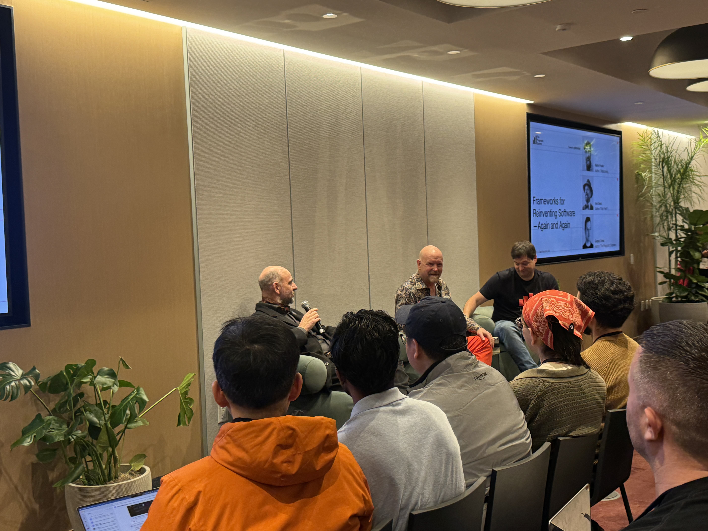
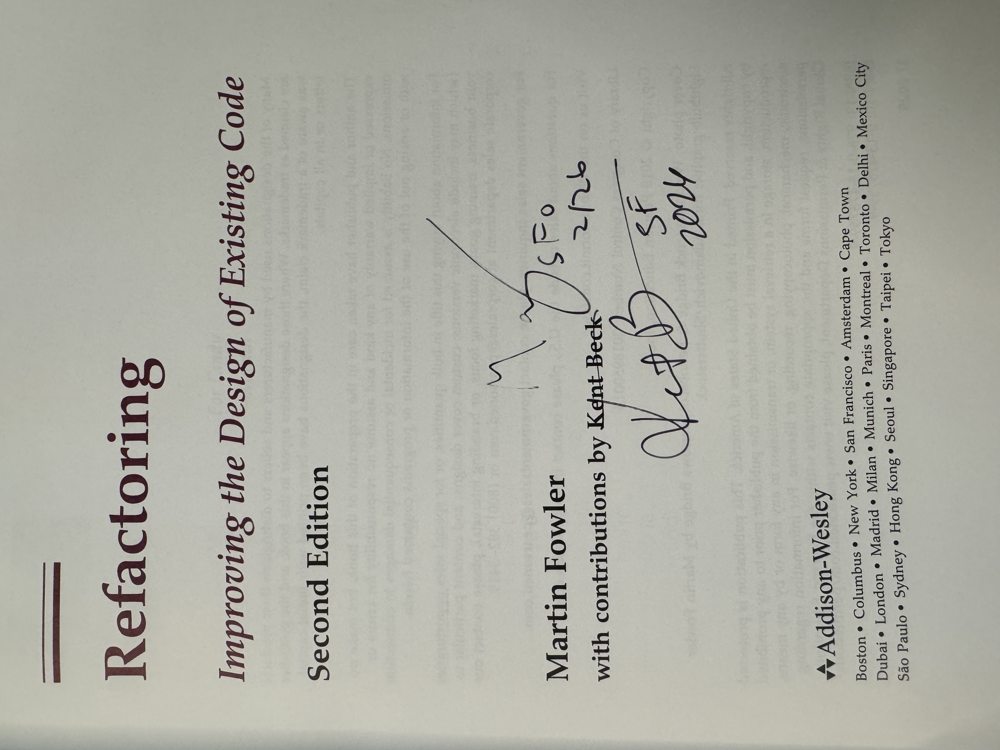

Title: Pragmatic Summit - Nobody has the Answers on AI
Date: 2026-03-09 21:21
Tags: ai, career, engineering, management, leadership, navigating change

[TOC]

# Nobody Has the Answers

I got my copy of "Refactoring" signed by both Martin Fowler and Kent Beck. That alone would have been worth the conference. What they shared in person at the Pragmatic Summit in SF was pure gold, Kent Beck put it bluntly:

> "At this moment, nobody knows the answers to anything."

## Martin Fowler and Kent Beck walk into a room full of AI startups

A decade ago [I saw Bjarne Stroustrup in person, and he signed my C++ book.](<https://blog.john-pfeiffer.com/meeting-bjarne-stroustrup-creator-of-c-plus-plus-in-the-atlassian-dev-den/>)

25 years after the **[Agile Manifesto](https://agilemanifesto.org/)**, two people who shaped the foundations of modern software engineering walked into a room full of AI-native startups and engineering leaders.

If you haven't heard of Martin Fowler then you're in for a huge treat, so many incredible thoughts about software development (shared at <https://martinfowler.com/>)

And Kent Beck's decades of wisdom (Extreme Programming, TDD, JUnit, etc.) are in books, substack posts, articles, podcasts, etc.

- <https://kentbeck.com/>
- <https://tidyfirst.substack.com/>
- <https://newsletter.pragmaticengineer.com/p/tdd-ai-agents-and-coding-with-kent>

### Paradigm shift

There was a huge historical shift into the era of personal computing and the internet. And for 25 years, experienced engineers have had a playbook:

- Too many bugs? Here's how you write tests.
- Can't write tests? Here's how you design and architect your software.
- Go look up a (coding/architecture) pattern in the book

Now with LLMs it has become a completely different software development lifecycle and new tech stack; a whole different set of skills.

Kent Beck's poignant appeal (for geeks who love code): It doesn't feel safe right now.

His antidote:

> "You're just as smart as everybody else because you're just as ignorant as everybody else."

In the age of AI hype fatigue and [AI agent psychosis](https://lucumr.pocoo.org/2026/1/18/agent-psychosis/), I find this oddly reassuring.

# The Craft Still Matters

The most energizing takeaway from the session was that good engineering practices aren't becoming obsolete, they're becoming more important.

Fowler described a repeatedly heard pattern: well-modularized code makes it easier for AI agents to work effectively. Good test suites help agents just as much as they help humans. 

> "The Venn diagram of developer experience and agent experience is a circle."

One colleague told Beck that 20 years of pushing TDD was paying off now because...

> when you have "a big powerful genie," you need to know how to verify it's doing the right thing.

When you step away from hype around AGI and autonomous agents and use first principles thinking, this really makes sense.

Software engineering is not just programming: regardless of human or AI agent, it's based on foundations like complexity/modularity, design/documentation, tests, security, observability, etc.

## Learn the Tools 

Martin Fowler contended there's been snake oil in software for a long time, and "agile certification factories" (coaches, titles, etc).

His early experience with AI code completion in Emacs was bad enough that he nearly wrote it off entirely. Most completions were garbage. 

But he kept probing, found [Simon Willison's blog](https://simonwillison.net/), and saw someone continuously experimenting, with curiosity, learning the new tools; willing to show both the good and bad, to say "I don't know."

> Be skeptical about your skepticism

Kent Beck's version: "What's the least I can do to validate, to my own satisfaction, whether this claim is true or not?"

That experimental mindset has become, in his words, "a thousand times more valuable" in the last year. The answers change week to week. A tool that fails on Monday might work on Thursday. You can't have *the* answer. You can only have a practice of finding out.

## SDLC + AI

Previously a generation (or two) of developers used to:

- read requirements (PRD)
- systems design (hopefully?)
- write code (usually in an IDE)
- run tests (right?)
- submit pull request
- continuous integration
- continuous deployment
- smoketests
- observability and monitoring

*given the rate of change I hope this doesn't become obsolete in a month ;)*

**Emerging SDLC With AI**

- deep research agent creates a report on the domain
- LLMs "architect persona" brainstorms and rubber duck options
- Using agents with Skills to plan and decompose the work
- A carefully crafted prompt kicks off a series of agents in parallel
- Human reviews and refines Test Cases and Guardrails, defines verifiability
- Human creates Evals for the critical or non-deterministic portions of the workflow/service/product
- A series of specialized agents (security, design, etc) review the agent produced artifacts
- CI/CD and automated tests run; agents autonomously attempt fixes for anything failing
- Human reviews the proposed output, any test failure escalations, eval scores
- Production deployment triggers extra LLM traces and privacy protecting prompt logging

# Shift Focus to the System

Kent Beck's personal reflection resonated: the deep satisfaction of refactoring code and taking a messy file, making tiny safe steps, watching clarity emerge. Then he said plainly: **"I can't do that anymore."**

Previously software engineers who were great at managing the code line-by-line and the attendant complexity, like using Tidy First or TDD, they had huge leverage.

*There was a time when hand-writing optimized assembly was the high-leverage skill, then compilers made that less valuable.*

The leverage in the craft is now understanding the **domain** and its connection to the software, the system. Not optimizing the code in a specific function or file.

This makes sense to me: so many complaints about microservices are due to an absence of [Domain Driven Design](https://se-radio.net/2015/05/se-radio-episode-226-eric-evans-on-domain-driven-design-at-10-years/), and missing the "value stream" — what are we building, for whom, and how does this piece connect to the whole?

Human intent: what was the system designed to do?

## Measuring Success

Kent Beck's right that companies have very high hopes:

> Expecting better, faster, cheaper

*and his experience has been that inside a company, the incentives are so misaligned with actually achieving that*.

AI can generate code fast, but *human intent and system understanding* are what drive it toward quality outputs and remarkable outcomes.

Kent Beck pointed out: carpentry didn't end because of circular saws (or nail guns). People just got more powerful tools.

In my opinion, measuring Lines of Code or Pull Requests is a poor proxy that's not correlated with the full outcome.

### Burnout

And we've always known about software and burnout; clearly people coding need breaks because overwork creates bad ideas and negative value.

I know that when I'm in the zone and stay up well past midnight coding... then the morning comes. After sleeping, reviewing with fresh eyes (and brain) reveals so many obvious bugs and mistakes in the logic.

I also know from more than a decade of managing engineers that product release "death marches" and working nights and weekends degrades a team beyond repair, people are cranky and can no longer function together.

Once I even had to explain to the C-Suite: fine, we'll work weekends, but what days are left when that's no longer enough?

# Conclusion

Seeing Kent Beck and Martin Fowler in person reinforced that really wise thought leaders in the industry also like corny jokes and find conference chairs uncomfortable.

Clearly they are beacons for quality craftsmanship, and their message was "experiment and learn to use this new tool well".

I also took away that we need to measure the impacts of the "new way" on outcomes we care about: users/customers, revenue... and the people building the software.

# Resources

The conference: **<https://www.pragmaticsummit.com/>**

The specific session, and the amazing Pragmatic Summit 2026 playlist:

- <https://www.youtube.com/watch?v=CZs8J1ZD0CE&list=PLzwJJv8h-icjtYA5oHmc7g6qU1t4OqDqb&index=8>
