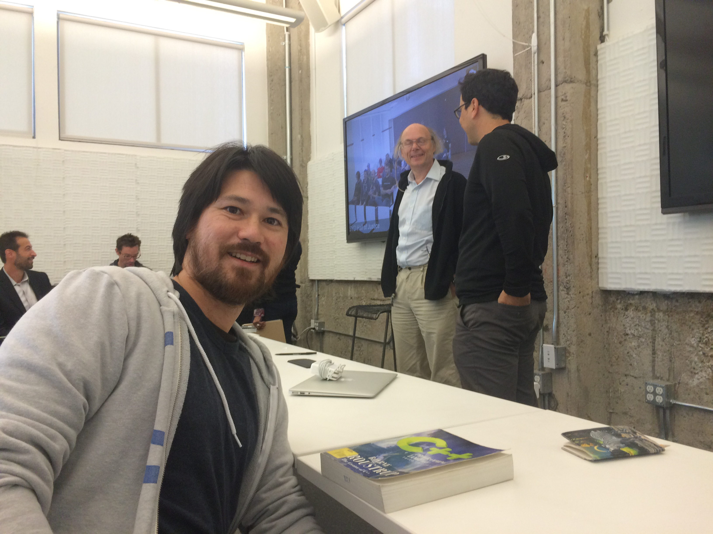

Title: Meeting Bjarne Stroustrup, creator of C plus plus, in the Atlassian Dev Den
Date: 2015-06-03 20:30
Tags: c++, cpp, atlassian

[TOC]

### Bjarne Stroustrup visits Atlassian

One of the things I looked forward to when joining Atlassian was being a part of a culture that celebrated software development.

Today I had the opportunity to meet Bjarne Stroustrup <http://www.stroustrup.com/>, creator of C++. (yey)

To put this in perspective, C++ is one of the most popular programming languages of all time and is essentially like meeting the inventor of the hammer. (mindblown)

To summarize, he was one of the most intelligent, mindful, humble, and quietly passionate people I have ever met.  Truly an inspiration to any engineer.

*I have taken a tiny amount of free license due to my faulty memory and for readability.*

### Getting the book signed

I had dug out my old The C++ Programming Language (3rd edition from 1997) which filled me with nostalgia of how amazing it was to read a text book that was just full of succinct coding amazingness.  So many textbooks were full of fluff, confusion, and downright goofiness but that book opened my mind to the difference it makes to have the original inventor writing it (Kernighan and Ritchie ;)

Lucky me, I was there about 15 minutes early and while they got the Audio/Video set up I bravely politely asked him to sign it. (yes, success!)

There was one other co worker there who was helping him prepare (and apparently also a huge fan, I took her picture with him) and I managed to ask some small talk questions (go me!)

Bjarne seemed distant at first and his driver/handler (former Chief Technology Officer somewhere important) was maybe a bit apprehensive but I suspect the fan-ness of it all relaxed a bit after we proved we weren't pyschos...

"This book was really amazing."  He responded, "Well this one is a bit old, you should use a newer edition".

I quickly replied, "I don't actually use this in my day to day work so I keep it at home. It's a bit heavy to carry around all the time, I read a lot of things on my phone (easier to get the latest version of the books)."

I must have hit a topic of interest for him as he came over and I had flipped open the book to some sample code.

He ruminated, "Well, actually, I prefer this kind of reading with a book.  The formatting and print... you have to work hard to make sure the examples don't get split across pages.  And you have two pages." (Gesturing with his hands the extra width)

I agreed with him, "Yes, it is certainly a lot easier to read the diagrams and code examples in a physical book.  The phone screen is really small.  I guess the book is a perfected technology that's been around 1000 years."

"You know Atlassian isn't really a C++ shop, more Java with some Javascript... and Python products teams here in SF.  Actually it's even a really argumentative culture sometimes around technology, though with you here I'm sure they'll all be quiet and respectful."

He actually smiled at that, "Back in AT&T we would ask: was there blood on the floor? That was how serious the discussions got.  Not really any blood on the floor, just an expression."

"What do you enjoy most from your travels/touring?"

Such a wise response: "Meeting the people, learning about what they're thinking and what new ideas they might have".

Looking around the mostly empty room with 1 minute before the event starts, "Well I don't know where everyone else is, I'm sure there's lots of interest but the SF office is the Marketing and Business headquarters with only a few Development/Product teams".  He responded, "Yesterday Facebook was standing room only."

I looked over at the monitors, "Well I'm sure there'll be attendance from the other offices too".  

"What other locations does Atlassian have?" 

"Austin, and of course Sydney has 800 Java Developers, and Poland, and Vietnam, it's a pretty globally diverse company".

I also warned him about the air conditioning intermittently coming on and being loud and often too cold.  "I was baking hot yesterday so I guess if it's cold in here today I guess it will average out". (With his curious funny little smile)

**And with the microphone on and an international audience he was introduced and here were the questions and answers...**

### Current challenges for programming languages

Since hardware improvements are through parallelization (unless quantum entanglements gets solved soon) developers must adapt, but concurrency is hard.  (And no global variables, right?)

"Functional programming has good ideas but I did not want everything to be a recursive function"

Distributed systems are a new perspective problem: for a fair trade, an exchange in New York offering the same price to Sydney and San Francisco becomes difficult (the speed of light is still a limit).

Anyone heard of the leap second?  There are at least 3 ways it is being dealt with:

1. Hold on for a really long time and then jump forward all at once.
2. Jump forward immediately.
3. Break the leap second into a lot of intervals and merge it in.

But if it's a distributed system how can everyone agree?  And that's just one example.

### Trends in programming?

Silicon Valley is an echo chamber but you probably know more than I do.  

Mobile is very hot but it is a very small screen, and not everything (like a textbook) can be read on a small phone screen or even a tablet screen.

### A second favorite language?

Bjarne was incredibly diplomatic about pointing out that any language he said he preferred might be tweeted and start a "language war";  language comparisons are useless without the context of the constraints of the problem domain.

For instance he had written C++ to be a performant language with the assumption of unix shell as the "other language".

But what about Rust "Zero Cost Abstractions"? "It's not good to pay for what you don't use."

He admitted that since he coined the phrase "Abstraction without overhead" that indeed he admired the goal of Rust (getting close to the hardware for maximum performance) but hadn't been following their recent developments.  For garbage collection... you shouldn't litter.

<http://blog.rust-lang.org/2015/05/11/traits.html>

Languages are about solving problems so I am very familiar with the strengths and weaknesses of C++ and I know how to make it do quite a lot.  But if I use another language then I am an amateur, not familiar with the idioms, and perhaps I will not use it so well.

### Any features you regret putting in or leaving out of C++?

No, everything in there has a use and ... they have to stay or it would upset thousands of people.    I wish it had better syntax, starting from C, well even they realized it was a mistake but it was already done so what are you going to do.

Anything you put in a language, especially a mistake, will stay with you.  Maybe you can put something off to release a product and know you will get back to it in an iteration or two.  But make a mistake with a language and you live with it for a couple of decades.

I do wish I had gotten some things right earlier.  Templates.  They solved the problem really well, general enough to do more than I imagined (that's the criteria for sucess).  Nobody else at the time knew how to solve it but I wish the interface was better.  Now, with the upcoming "Concepts", it will be better, but I wish I had done it right the first time.

You have to understand, at the time of creation C was constrained to 64K, and C++ to 256K, so there are simply things you cannot do then.

### A complicated question about the N4047 modules proposal

It was a good proposal.  Isolating code from other portions to make compilation faster.

C++ is maintained by people who actually pay 1280 to be on the committee... they don't make any money by doing it. Daveed Vandevoorde had to continue working and doing this proposal was something on the side.

If it is not in my top 20 then it's not an important problem.  So a lot of good proposals do not make my top 20.

More recently teams in Microsoft, Google, GCC, and Clang are looking at this and some will even have implementations before it is released.

It should be including in release 17 and you may see a compilation speedup between %50 and 50x , maybe more usually 4x or 8x faster.

Language features are complicated as you have to coordinate between all of the major tool chains (you certainly can't have one of them do it one way and another differently).

### How many languages?

When asked about whether a developer should focus on one language or learn many Bjarne had a very nuanced answer:

> When he started programming it was not impossible to learn 25 languages.  It is very valuable to learn the different ways of thinking and solving problems by programming in a different language. Now though, languages are more complex with a lot of libraries, idioms, and toolchain to learn. 

> So learning two languages, like the example before of 1 performant and 1 more general, would not be enough since that would not provide any comparison of why. Maybe 4, so that you could compare two general and two performant languages and understand how/why they did things differently.

### My Question

*I decided to mull over and try and ask a live question (with an audience this time).*

**"Given your comment about tooling before, how valuable do you find developer tools to a programming language (like an IDE)?  Also, what are any major gaps you see in current tools?"**

"Good question.  I don't really use tools that much since I work on smaller examples that might need to be ported in a few places.  On larger projects and code bases tooling is very useful as you can't keep all of it in your head anymore.  I'm maybe not the best person to ask, you probably work on large code more than I.  But just being able to click on a macro or identifier and jump to it in the code is very useful."

"I don't use a debugger very often.  Other people might but I don't.  If you are using a debugger it's maybe a bad sign about your code. But I would like to see a debugger that could follow concurrency.  That would really help."

"Tests are really important, so tools that make it easy to run tests, and to write tests quickly, that would be very useful."

### What is a professional?

If someone, your employer or your manager, asks you to do something that is shabby you should just resign.  It doesn't happen very often but there are ethics.

I wish the Universities, that teach "Computer Science" and not programming, would spend some time on caching or real world coding and problems.  They graduate being able to describe the Halting Problem but with magic constants throughout their code.

It would be nice if there was a more universal way to explain/teach being "professional" in software.

### C++ in Education

Bjarne was asked and clearly had some strong feelings on the subject of why C++ wasn't taught in universities.

"Perhaps it's because C++ doesn't have a marketing budget" he quipped.  More seriously he went on to point out "he had very successfully taught college freshman programming in C++ so it's quite possible.  There isn't enough time to teach all of C first so you don't start with that: for instance pointers are chapter 17, not chapter 2."

### More info
An interesting interview he gave for comparison: <http://www.stroustrup.com/CVu263interview.pdf>
